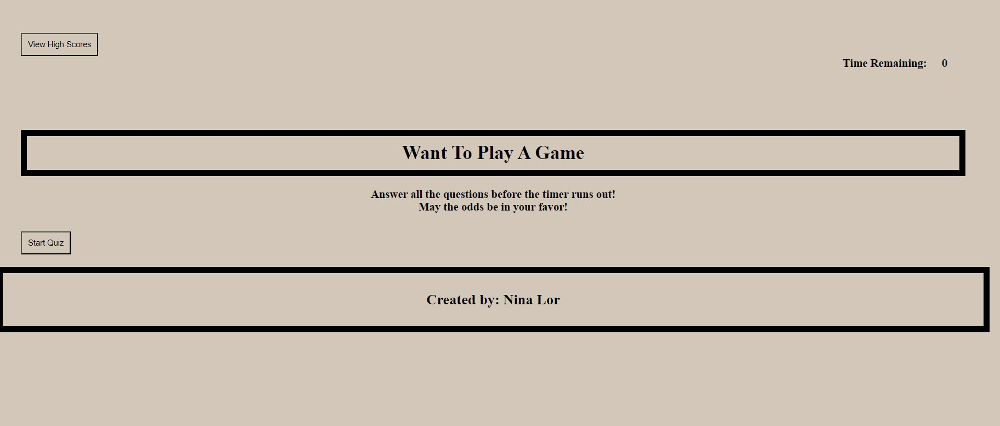
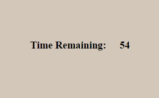
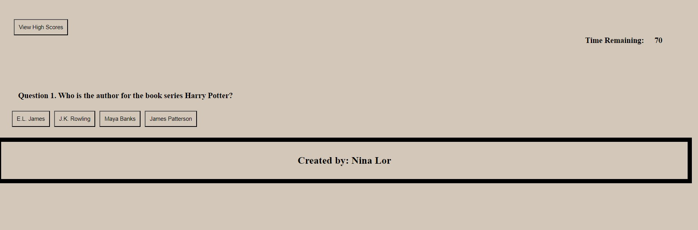
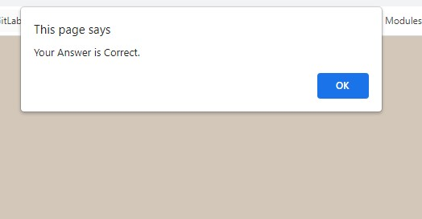
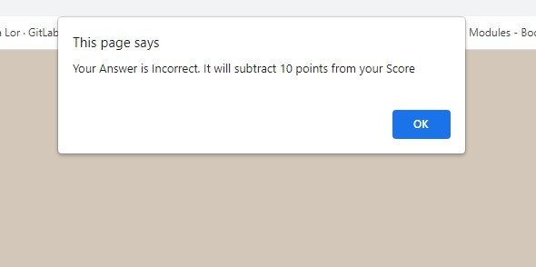
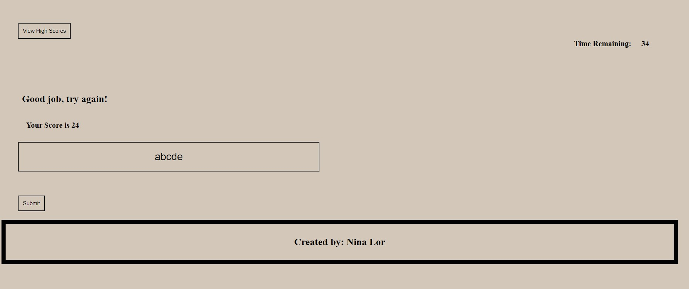

# want-to-play-a-game
challenge 4- Web API's

In this game, it will give you question's and you are suppose to answer them. The answer's will come in multiple choices as in A,B,C,D.

* This challenge will give you question's to answer and once you answers's all the question's, another window will pop-up and show you the score.

* The results at the end will show you the score base on the answer you picked.

* Front page of the quiz

* Once you press the 'START' button, the timer will start

* There are 5 questions to this challenge, and as each one is shown, you must select the correct answer.

* If you select the correct answer the prompt will show this:

* If you select the wrong/incorrect answer, the prompt will show this: 
* And 10 seconds will be removed from the timer.

* Once you've completed the quiz, it will take you to the end.

* Enter in your name in the box (Max is 5 letters/characters)

On the top right corner is the timer remainer that you have left.
And above the name box, it will show the final score.

* That is the end of this Quiz Challenge. Hope you enojy!

Github : https://github.com/ninalor02

Github live page: https://ninalor02.github.io/want-to-play-a-game/

