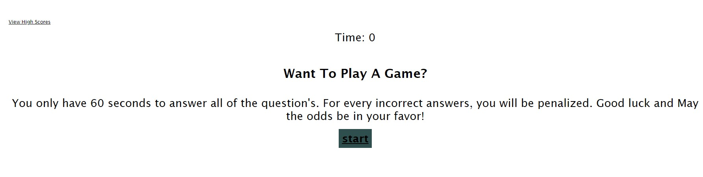
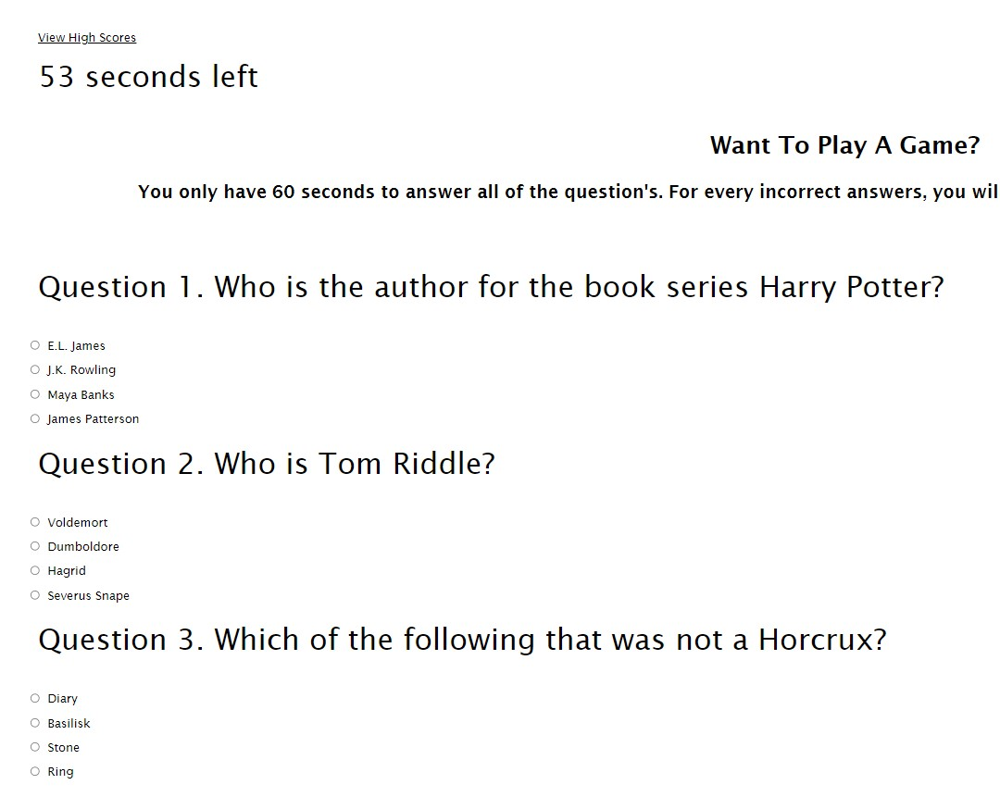
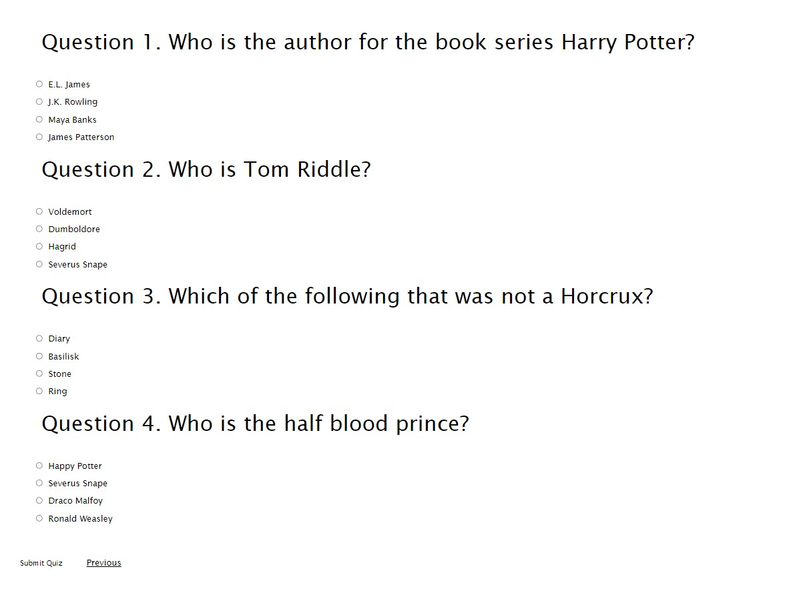

# want-to-play-a-game
challenge 4- Web API's

In this game, it will give you question's and you are suppose to answer them. The answer's will come in multiple choices as in A,B,C,D.

* This challenge will give you question's to answer and once you answers's all the question's, another window will pop-up and show you the score.

* The results at the end will show you the score base on the answer you picked.

* Front page of the quiz

* Once you press the 'START' button, the timer will start

* This questions

* Once you click on the radio button, you should be able to select only 1 answer per question

* Once you click 

// unable to set js up correctly//

Github : https://github.com/ninalor02

Github live page: https://ninalor02.github.io/want-to-play-a-game/

HTML files

There are 3 files to HTML 
- Front page
- Question/Quiz page
- score 

CSS files

There are 3 files to the CSS, as 1 of each of the css belongs to one of each  own HTML.

